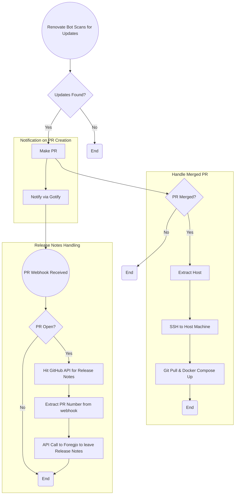

# Auto-Homelab

Homelab docker-compose environment defined in code. Using Forgejo Actions and Renovate bot for CI, AWX Tower and Forgejo Actions for CD. This is how I keep my Homelab UTD.

  <a href="https://git.mafyuh.dev/mafyuh/Auto-Homelab/wiki">Wiki</a> | 
  <a href="https://loganmarchione.com/2022/10/how-to-run-renovate-on-a-self-hosted-gitea-and-drone-instance/">How to Setup</a> |
  <a href="https://mafyuh.com">Blog</a> |
  <a href="https://www.youtube.com/watch?v=5CkCr9U_Q1Y">Inspiration</a> |
  <a href="https://git.mafyuh.dev/mafyuh/IaC-Homelab">Infrastructure</a>

| Hypervisor | OS | Tools | VPS (arm) | Firewall |
|---|---|---|---|---|
|  |   |   |  |  | 

## Apps in Repo:
<table>
    <tr>
        <th>Logo</th>
        <th>Name</th>
        <th>Description</th>
    </tr>
    <tr>
        <td></td>
        <td><a href="https://adguard.com/en/adguard-home/overview.html">AdGuard Home</a></td>
        <td>Network Wide DNS adblock as well as my DNS server (2/2)</td>
    </tr>
    <tr>
        <td></td>
        <td><a href="https://docs.linuxserver.io/images/docker-adguardhome-sync/">AdGuard Home Sync</a></td>
        <td>Syncs my instances of Adguard</td>
    </tr>
    <tr>
        <td></td>
        <td><a href="https://goauthentik.io/">authentik</a></td>
        <td>Open Source Identity Provider </td>
    </tr>
    <tr>
        <td></td>
        <td><a href="https://www.bazarr.media/">Bazarr</a></td>
        <td>Downloads subtitles for Radarr/Sonarr</td>
    </tr>
    <tr>
        <td></td>
        <td><a href="https://www.cloudflare.com/products/tunnel/">Cloudflare Tunnels</a></td>
        <td>How I expose some of these services</td>
    </tr>
    <tr>
        <td></td>
        <td><a href="https://codeberg.org/Codeberg/pages-server">Codeberg Pages</a></td>
        <td>Github Pages for Gitea installs. hosts https://mafyuh.co</td>
    </tr>
    <tr>
        <td></td>
        <td><a href="https://github.com/kiranshila/Doplarr">Doplarr</a></td>
        <td>Allows my users to request content through Discord if they choose</td>
    </tr>
    <tr>
        <td></td>
        <td><a href="https://github.com/FlareSolverr/FlareSolverr">FlareSolverr</a></td>
        <td>Proxy server to bypass Cloudflare and DDoS-GUARD protection</td>
    </tr>
    <tr>
        <td></td>
        <td><a href="https://forgejo.org/">Forgejo</a></td>
        <td>This site</td>
    </tr>
    <tr>
        <td></td>
        <td><a href="https://code.forgejo.org/forgejo/runner">Forgejo Runner</a></td>
        <td>Runs CI/CD tasks Yamllint and Renovatebot and CD through AWX</td>
    </tr>
    <tr>
        <td></td>
        <td><a href="https://gotify.net/">Gotfiy</a></td>
        <td>Self hosted notification service</td>
    </tr>
    <tr>
        <td></td>
        <td><a href="https://homarr.dev/docs/getting-started/installation/">Homarr</a></td>
        <td>Homelab dashboard that integrates with the arr's so I see data in 1 place</td>
    </tr>
    <tr>
        <td></td>
        <td><a href="https://github.com/jellyfin/jellyfin">Jellyfin</a></td>
        <td>Open Source Streaming Service for home media like Plex</td>
    </tr>
    <tr>
        <td></td>
        <td><a href="https://github.com/Fallenbagel/jellyseerr">Jellyseerr</a></td>
        <td>Request platform for my Jellyfin user's to request content</a></td>
    </tr>
    <tr>
        <td></td>
        <td><a href="https://github.com/hrfee/jfa-go">jfa-go</a></td>
        <td>Used for some PPV/Live TV automations to create users for certain periods of time</td>
    </tr>
    <tr>
        <td></td>
        <td><a href="https://docs.linuxserver.io/images/docker-kasm/">Kasm</a></td>
        <td>Docker container streaming platform for browser-based access to desktops, applications, and web services</a></td>
    </tr>
    <tr>
        <td></td>
        <td><a href="https://wiki.servarr.com/en/lidarr">Lidarr</a></td>
        <td>Music Collection Manager</td>
    </tr>
    <tr>
        <td></td>
        <td><a href="https://github.com/LinkStackOrg/linkstack-docker">LinkStack</a></td>
        <td>Creating a static links page for my Jellyfin users</td>
    </tr>
    <tr>
        <td></td>
        <td><a href="https://github.com/jlesage/docker-makemkv">MakeMKV</a></td>
        <td>Used to rip Bluray's with my LG BU40N drive </td>
    </tr>
    <tr>
        <td></td>
        <td><a href="https://docs.mindsdb.com/what-is-mindsdb">mindsdb</a></td>
        <td>Connects Ollama models to 100+ different databases, easy to use.</td>
    </tr>
    <tr>
        <td></td>
        <td><a href="https://netboot.xyz/">Netboot.xyz</a></td>
        <td>Network boot instead of using my ventoy USB</td>
    </tr>
    <tr>
        <td></td>
        <td><a href="https://nginxproxymanager.com/">Nginx Proxy Manager</a></td>
        <td>Reverse Proxy used for its simplicity (1/3)</td>
    </tr>
    <tr>
        <td></td>
        <td><a href="https://n8n.io">n8n</a></td>
        <td>Self hosted automation platform, Zapier alternative, switched from ActivePieces</td>
    </tr>
    <tr>
        <td></td>
        <td><a href="https://ollama.com/">Ollama</a></td>
        <td>Easiest way to run LLM's on your own hardware</td>
    </tr>
    <tr>
        <td></td>
        <td><a href="https://github.com/open-webui/open-webui">open-webui</a></td>
        <td>Creates a ChatGPT like web interface for talking to Ollama models</td>
    </tr>
    <tr>
        <td></td>
        <td><a href="https://github.com/portainer/portainer">Portainer</a></td>
        <td>Web-based management for learning Kubernetes, I learned Docker this way and will Kub as well</td>
    </tr>
    <tr>
        <td></td>
        <td><a href="https://prowlarr.com/">Prowlarr</a></td>
        <td>Searches indexers for Radarr/Sonarr</td>
    </tr>
    <tr>
        <td></td>
        <td><a href="https://github.com/binhex/arch-qbittorrentvpn">qBittorrent VPN</a></td>
        <td>Modified qBittorrent with VPN killswitch enabled</td>
    </tr>
    <tr>
        <td></td>
        <td><a href="https://radarr.video/">Radarr</a></td>
        <td>Movie Collection Manager</td>
    </tr>
    <tr>
        <td></td>
        <td><a href="https://sabnzbd.org/">Sabnzbd</a></td>
        <td>Usenet downloader to download content</td>
    </tr>
    <tr>
        <td></td>
        <td><a href="https://wiki.servarr.com/sonarr">Sonarr</a></td>
        <td>Radarr, but for TV Shows</td>
    </tr>
    <tr>
        <td></td>
        <td><a href="https://hub.docker.com/r/sonatype/nexus3/">Sonatype Nexus</a></td>
        <td>Self-hosted Docker registry to help lower Docker pulls</td>
    </tr>
    <tr>
        <td></td>
        <td><a href="https://syncthing.net/">Syncthing</a></td>
        <td>How I backup all config files, following 3-2-1 backup procedure</td>
    </tr>
    <tr>
        <td></td>
        <td><a href="https://twingate.com">Twingate Connectors</a></td>
        <td>Main VPN between homelab and cloud VPS's</td>
    </tr>
    <tr>
        <td></td>
        <td><a href="https://github.com/louislam/uptime-kuma">Uptime Kuma</a></td>
        <td>Self hosted service uptime tracker</td>
    </tr>
    <tr>
        <td></td>
        <td><a href="https://github.com/ahmetoner/whisper-asr-webservice">Whisper</a></td>
        <td>AI Model that I use to generate subtitles for Bazarr when they can't be found</td>
    </tr>
</table>

## Apps not yet in repo:
<table>
    <tr>
        <th>Logo</th>
        <th>Name</th>
        <th>Description</th>
    </tr>
    <tr>
        <td></td>
        <td><a href="https://github.com/ansible/awx">AWX (Ansible Tower)</a></td>
        <td>Used to easily run Ansible playbooks on all my VM's, and now CD for this repo, installed on K3s</td>
    </tr>
    <tr>
        <td></td>
        <td><a href="https://hub.docker.com/r/grafana/grafana-oss">Grafana</a></td>
        <td>Monitoring for various services</td>
    </tr>
    <tr>
        <td></td>
        <td><a href="https://wordpress.org/">Wordpress</a></td>
        <td>WooCommerce store setup for JF PPV access</td>
    </tr>
    <tr>
        <td></td>
        <td><a href="https://guacamole.apache.org/">Guacamole</a></td>
        <td>Remote access in browser via SSH, RDP, VNC, etc</td>
    </tr>
    <tr>
        <td></td>
        <td><a href="https://www.home-assistant.io/">Home Assistant</a></td>
        <td>Slowly migrating over to Home Assistant from Google Home</td>
    </tr>
    <tr>
        <td></td>
        <td><a href="https://plausible.io/">Plausible</a></td>
        <td>Analytics tracker for certain websites (Blog)</td>
    </tr>
    <tr>
        <td></td>
        <td><a href="https://wazuh.com/">wazuh</a></td>
        <td>Security platform monitoring everything with agents installed on all VM's</td>
    </tr>
</table>

## Full Workflow Chart

## To-Do

[View Project Board](https://git.mafyuh.dev/mafyuh/Auto-Homelab/projects/1)