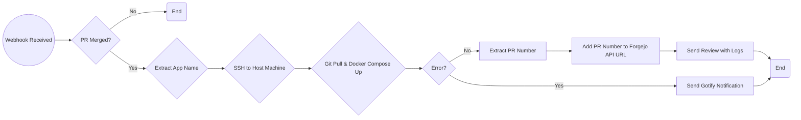

# n8n Continuous Deployment
Previously used this script for CD, it worked, but I wanted an instant deployment and not just ran on a schedule. So I created an n8n automation. Here's the visual breakdown:



## Outline

- Webhook is sent whenever a PR is merged
- Filters out any new, edited or re-opened PR's
- Checks the PR title for app name, which is filtered so each SSH session matches based on the IF conditions.
- SSH in to the machine that hosts that docker compose stack running git pull and docker compose up -d 
- Optional, If there is any error message we sent Gotify a link to the PR and error message
- Set number from JSON to number in n8n
- Add that number to URL of API request to Forgejo which we add a review with the logs if no errors. https://git.mafyuh.dev/mafyuh/Auto-Homelab/pulls/222#issuecomment-1799

The only exception is n8n itself. Which for now I will manually update.

To import this into your n8n, create a new workflow, top right click 3 dots - Import from URL and paste https://git.mafyuh.dev/mafyuh/Auto-Homelab/raw/branch/main/scripts/CD.json 

## dccd instructions (no longer used besides ag-backup)

Modified version of https://github.com/loganmarchione/dccd, with Gotify notification on error and allowing to choose which directory is cd'd into before running script. I run this on each docker host through crontab every 30 minutes, just adding the -f flag with the folder which that host represents. So each directory represents a host

Clone this repo:
```
git clone https://git.mafyuh.dev/mafyuh/Auto-Homelab.git
```

Make executable:
```
sudo chmod +x /home/mafyuh/Auto-Homelab/scripts/dccd.sh
```
Example:
```
./dccd.sh -b main -d /home/mafyuh/Auto-Homelab -p -f 'arrs'
```
Crontab every 30 mins:
```
*/30 * * * * /home/mafyuh/Auto-Homelab/scripts/dccd.sh -b main -d /home/mafyuh/Auto-Homelab -l /tmp/dccd.txt -p -f 'arrs'
```
View Logs:
```
cat /tmp/dccd.txt
```
Export Variables:
```
export GOTIFY_BASE_URL="https:go.example.com"
export GOTIFY_TOKEN="token"
```
Full Usage:
```
Options:
      -b <name>       Specify the remote branch to track (default: main)
      -d <path>       Specify the base directory of the git repository (required)
      -h              Show this help message
      -l <path>       Specify the path to the log file (default: /tmp/dccd.log)
      -p              Specify if you want to prune docker images (default: don't prune)
      -x <path>       Exclude directories matching the specified pattern (relative to the base directory)
      -f <pattern>    Specify the pattern for folder names to match
```